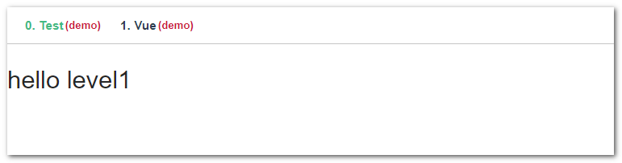
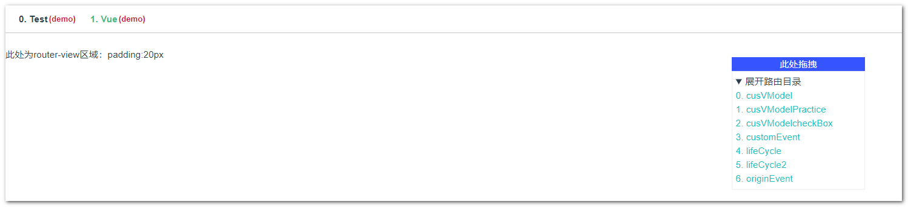
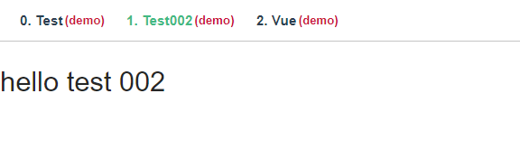
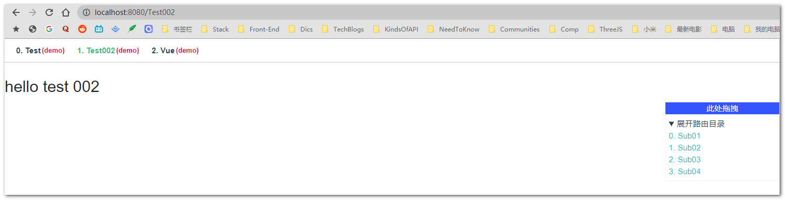
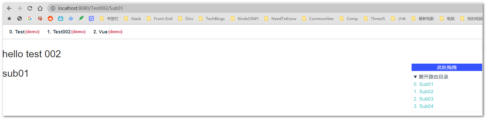

# demo-vue

## Project setup

```
npm install
```

### Compiles and hot-reloads for development

```
npm run serve
```

### Compiles and minifies for production

```
npm run build
```

### Customize configuration

See [Configuration Reference](https://cli.vuejs.org/config/).

[toc]

# 重要说明

本项目专用于 Vue 框架下的技术测试用 demo 实验台，借助了 node 的本地文件读取能力生成动态路由，因此也意味着只能用于开发测试用。

## 如何运行的？

### 动态生成的路由表

在 src\router\index.js 中，做了一些本地文件读取的处理，处理的路径为 src\views
你所有的实验 demo 都应该在此目录下进行。

在项目执行时，main.js 中引入了路由：
它仅做了二级嵌套的处理，处理方式也非常原始，就是字符串匹配的形式去处理。

- 1.首先，查找 src\views 下所有目录， 然后认定目录下如果存在 index.vue 的文件，则被视作为 "一级目录"；
- 2.查找去判断各个一级目录下，是否存在二级的文件夹，同样的，如果二级文件夹下存在 名为 index.vue 的文件，那么该文件家将被视作为 "二级目录"；

例如：

```bash
jayce@jayce123:views$ tree
.
├── Test
│   ├── TestSub
│   │   └── index.vue
│   └── index.vue
└── Vue
    ├── cusVModel
    │   ├── comps
    │   │   └── child.vue
    │   └── index.vue
    ├── cusVModelPractice
    │   ├── comps
    │   │   └── CusAreaCascader.vue
    │   └── index.vue
    ├── cusVModelcheckBox
    │   ├── comps
    │   │   └── child.vue
    │   └── index.vue
    ├── customEvent
    │   ├── comps
    │   │   └── child.vue
    │   └── index.vue
    └── index.vue
```

该目录结构下将会生成以下路由：

```javascript
[
  {
    path: "/Test",
    name: "Test",
    children: [
      {
        path: "/Test/TestSub",
        name: "TestSub",
      },
    ],
  },
  {
    path: "/Vue",
    name: "Vue",
    children: [
      {
        path: "/Vue/cusVModel",
        name: "cusVModel",
      },
      {
        path: "/Vue/cusVModelPractice",
        name: "cusVModelPractice",
      },
      {
        path: "/Vue/cusVModelcheckBox",
        name: "cusVModelcheckBox",
      },
      {
        path: "/Vue/customEvent",
        name: "customEvent",
      },
    ],
  },
];
```

注意，仅做了二级处理。

## 生成一级导航

在 App.vue 下
会生成所有一级路由的一个 navigation 导航菜单。



## 生成子路由菜单

有一个被公共注册的组件，

`<common-menu />`

你仅需要在一级目录所在目录下的 index.vue 中标记该组件并添加一个`<router-view>`即可。

就像这样：

src\views\Vue\index.vue：

```javascript
<template>
  <div class="bd">
    <common-menu />
    此处为router-view区域：padding:20px
    <div class="view-router-area">
      <router-view></router-view>
    </div>
  </div>
</template>
<script>
export default {};
</script>
```



## 示例：添加你自己的实验：

- step1: 在 src\views 下新建**一个含有 index.vue 文件的文件夹**， 该**文件夹将会成为一个一级目录**，也将被视作一个导航，像这样：

```bash
jayce@jayce123:views$ pwd
/mnt/e/Users/jayce/Desktop/laboratory/vue demo/demo-vue/src/views
jayce@jayce123:views$ ls
Test  Vue
jayce@jayce123:views$ mkdir Test002
jayce@jayce123:views$ touch Test002/index.vue
```

```javascript
index.vue 内容：
<template>
  <h1>hello test 002</h1>
</template>
```

此时页面如下：



如果你的实验只需要一个一级目录就够了，这样就可以了。 如果你希望有一个二级菜单。你还需要继续以下步骤：

- step2: 在 src\views\Test002 路径下，新建 N 个目录，**每个目录中需含有一个 index.vue 文件**。 注意**目录名，即是二级路由的路径名**，且二级菜单的路由名也是这个文件夹的名字。 所以需要注意一下命名规范。

  ```bash
  jayce@jayce123:Test002$ tree
  .
  ├── Sub01
  │   └── index.vue
  ├── Sub02
  │   └── index.vue
  ├── Sub03
  │   └── index.vue
  ├── Sub04
  │   └── index.vue
  └── index.vue
  ```

- step3 : 在 src\views\Test002\index.vue 中**引入 `<common-menu />`和 `<router-view>` 即可**

  ```javascript
  <template>
    <div>
      <common-menu />
      <h1>hello test 002</h1>
      <router-view></router-view>
    </div>
  </template>
  ```





你需要额外注意的是：

- 尽量让一级二级目录命名完全不同，否则可能会出现奇怪的问题。
- 如果遇到问题，可以尝试重新启动项目
